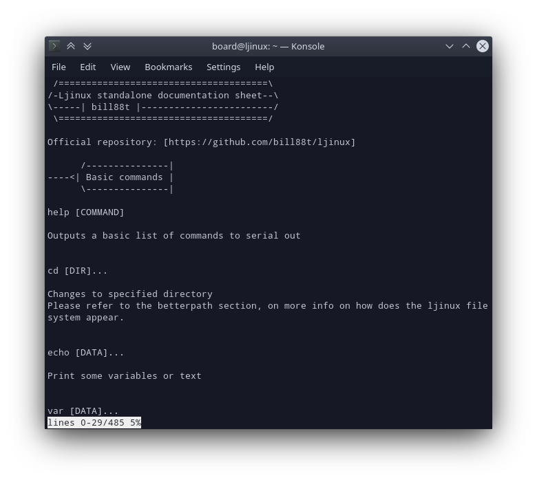
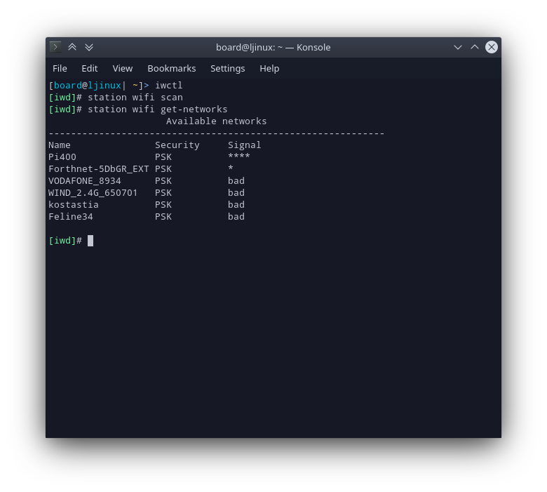

# Beryllium OS
A unix-like operating system for CircuitPython powered microcontrollers.   
(Formerly known as ljinux) 
 
<b>Important notes:</b> 
This project is still <b>in it's early developement</b>! 
The kernel API is undergoing massive breaking changes every day. 
This project is <b>NOT</b> a linux distribution. 
This project is <b>NOT</b> compatible with any linux code / binaries. 

<b><i>We also now have a [discord](https://discord.gg/V8AejwGpCv) server! 
If you need support or want to hang out, feel free to join in!</i></b> 

We also work with [Github Discussions](https://github.com/beryllium-org/OS/discussions). 

Table of Contents
=================
* [Prerequisites](#prerequisites-and-hardware-support)
* [Installation / updating](#installation--updating)
* [Packages](#packages)
* [Connection](#connection)
* [Directory structure](#directory-structure)
* [Manual](#a-complete-beryllium-manual-is-available)
* [Useful resources](#useful-resources-that-helped-with-the-development-of-this-project)

## Prerequisites and hardware support

Runs on CircuitPython <code>9.0.X</code>, <code>9.1.X</code> and <code>9.2.X</code>. 
Currently the supported boards are: 

Espressif: 
 - Adafruit Feather ESP32-S2 
 - Adafruit Feather ESP32-S3 TFT 
 - AiThinker ESP32-CAM 
 - DFRobot Beetle ESP32-C3 
 - Firebeetle 2 ESP32-S3 
 - LILYGO T-Deck 
 - LILYGO T-Watch-S3 
 - M5Stack Cardputer (Requires 9.1.0-beta1 or later) 
 - M5Stack Timer Camera X 
 - MakerGo C3 Supermini 
 - NodeMcu ESP32-C2 (experimental support) 
 - Wemos Lolin S2 Mini 
 - WeAct ESP32-C6 
 - Waveshare ESP32-S2-Pico 
 - Waveshare ESP32-S3-Zero 

Raspberry Pi: 
 - Adafruit KB2040 
 - Pimoroni Pico Lipo (16mb) 
 - Pimoroni Pico Lipo (4mb) 
 - Raspberry Pi Pico 
 - Raspberry Pi Pico W 
 - Waveshare RP2040-Zero 
 - Waveshare RP2040-Tiny 

Nordic: 
 - Seeed XIAO nRF52840 (Sense) 

SAMD: 
 - Seeed Wio Terminal 

 
But it can probably run on many more. 
 
The currently stable supported MCUs are: <code>ESP32</code>, <code>ESP32-S2</code>, <code>ESP32-S3</code>, <code>ESP32-C3</code>, <code>ESP32-C6</code>, <code>RP2040</code>, <code>nRF52840</code>, <code>SAMD51</code>. 
The currently unstable MCUs (experimental support) are: <code>ESP32-C2</code>. 
The currently unsupported CircuitPython-compatible MCU families / CircuitPython platforms are: <code>SAMD21</code>, <code>litex</code>, <code>mimxrt10xx</code>, <code>efr32</code>, <code>stm</code>. 
The MCU's that are currently unsupported are so because I either can't get my hands on a decent board with them or they don't have enough ram for it. 
 
The only real limiting factor should be ram, as about 70k (usable under circuitpython) are needed. 
<i>(If you have gotten it running on an unsupported board, feel free to pr)</i> 

## Installation / Updating

Installation from windows using scripts is only **supported** through WSL. 
Though, if you are windows user, this project **really** isn't for you. 
Linux and MacOS will work much better. 

1) Install a supported CircuitPython version onto the board. 
    Detailed instructions regarding CircuitPython can be found [here](https://learn.adafruit.com/welcome-to-circuitpython). 
2) Download the latest Beryllium OS release for your board and extract it onto it. 
    If your board has no stable release just yet, or you wish to use the latest and greatest, clone this repository and from within the "source" folder, run <code>make install</code> with your board mounted. 
    DO NOT run with <code>-j</code>!!! GNU/Make is assumed to be installed. 
    This command will automatically update the system files if they already exist. 
    To only update the core files, run <code>make kernel</code> instead. 
    If you only want to update the board extras, like drivers and packages, run <code>make extras</code> instead. 
    If you plan on loading the files remotely (via web/ble workflow), run <code>make BOARD=\*your board.board_id\* install</code> instead. 
    The files for you to copy will be created inside <code>source/build_\*your board.board_id\*</code>. 
3) *(Optional)* Load / Strap 3rd party packages. 
    More info regarding packages in [Packages](#packages)
4) Eject & powercycle the board 
    When it's plugged back in, you can connect to it via serial. 
    (You can use putty to connect to the board on Windows, Tio or GNU/Screen on Linux or MacOS) 
    Most Wi-Fi boards will start an AP and a telnet server. You can connect with default Wi-Fi credentials. 
    More info under [Connection](#connection)
<b>IMPORTANT NOTE: To make the board appear again as a usb drive on the host, run the Beryllium command </b><code>devmode</code>. 
More info regarding internal commands, available in the manual. 

## Packages
Most of what you need to use your board is already included with the stock installation. (Whatever drivers are implemented, are preloaded) 
However it's possible to install 3rd party packages using the Beryllium OS' package manager JPKG. 
You will have to install them seperately through the jpkg package manager. 
 
You can find beryllium packages in the [jpkg github topic](https://github.com/topics/jpkg). 

## Connection

To connect to the board it's recommended to use Putty for Windows and Tio for Linux/MacOS. 
A console that works with ANSI escape commands is <b>REQUIRED</b> (aka, not arduino ide).  

For Putty, select connection type to be Serial, select the port to be COM<b>X</b> where <b>X</b> is the number of the serial port allocated by the board, and set the speed/baudrate to 115200. 
(You can find which com port is allocated from within the Device Manager, it usually is COM3 or COM4)  

For Tio if you are on linux, you need to be in the <code>dialout</code> or <code>uucp</code> user group and to connect, run: <code>tio /dev/ttyACM0</code> 
If you are on a Mac instead, run: <code>ls /dev/tty.usb*</code> to find the device name, and connect to it by running: <code>tio /dev/tty.usb\<Device name here\></code> 
To disconnect, press <code>Ctrl</code> + <code>t</code>, <code>q</code>. 
To be added to the <code>dialout</code> group, run <code>sudo usermod -a -G dialout \<your username here\></code> and restart. 

Wi-Fi boards by default start a Wi-Fi hotspot by default and a telnet server. 
The default wifi credentials are: <code>beryllium-ap</code>/<code>CHANGEME WIFI PASSWORD</code> and can be changed from <code>&/settings.toml</code> 
The default hotspot IP is <code>192.168.4.1</code>. 

## Directory structure

<ul>
<li><code>base</code>, the base root filesystem that will be used to strap all other packages over it.</li>
<li><code>Boardfiles</code>, the different board ports and their configuration data.</li>
<li><code>bootcfg</code>, boot configuration files, to be cherrypicked by ports.</li>
<li><code>drivers</code>, different device drivers that may be build depending on the board.</li>
<li><code>other</code>, miscellaneous files, not used during installation.</li>
<li><code>packages</code>, most of these (if they are compatible with your board) will be bundles with every new installation.</li>
<li><code>scripts</code>, the files needed for compilation, and installation to a board.</li>
<li><code>source</code>, the source files for this project and co. They should be compiled into .mpy files, then into packages.</li>
</ul>

## A complete Beryllium manual is available

 https://github.com/beryllium-org/OS/blob/main/Manual.txt 
  

## Additional screenshots

## Useful resources that helped with the development of this project
 https://gist.github.com/fnky/458719343aabd01cfb17a3a4f7296797 
 https://en.wikipedia.org/wiki/ANSI_escape_code 
 https://github.com/todbot/circuitpython-tricks 
